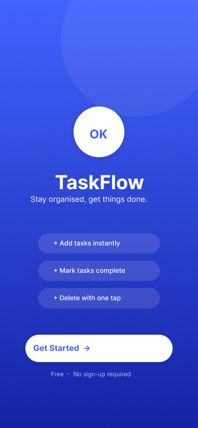
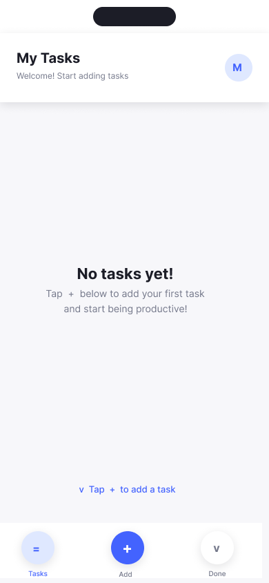
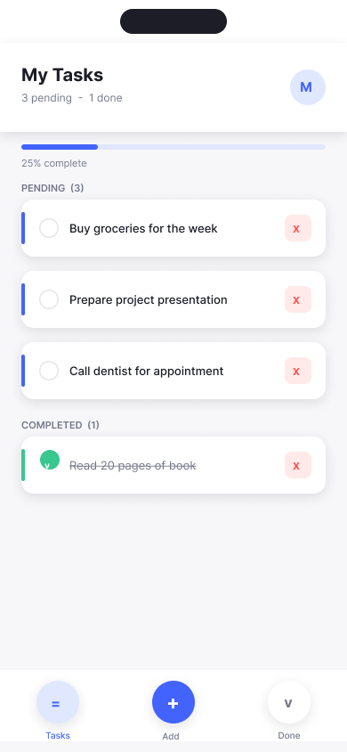
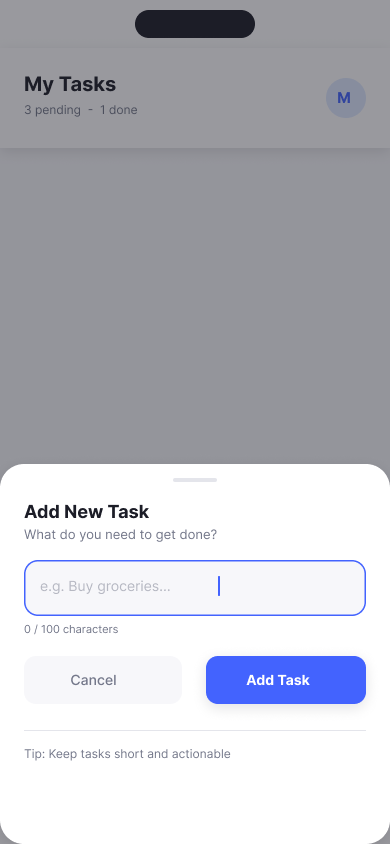
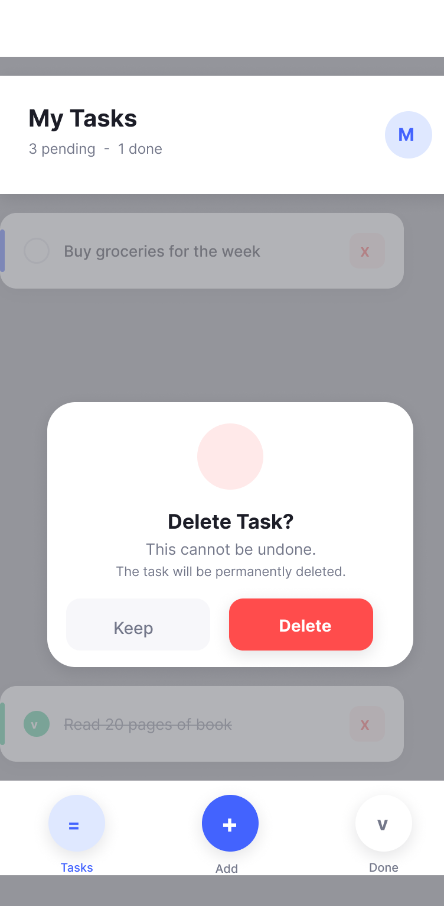
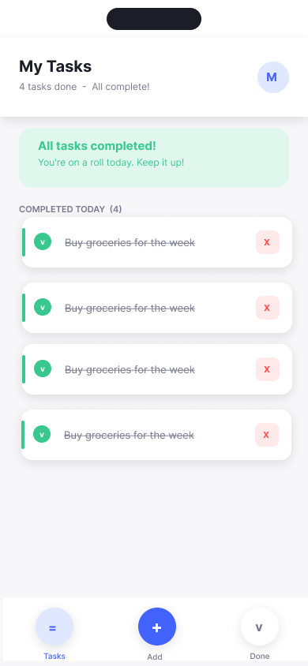

# TaskFlow — React Native Task Manager

A clean, animated task manager app built with Expo and React Native for the Chapter One Tech Screen.

## Setup & Running

```bash
# 1. Install dependencies
cd task-manager
npm install

# 2. Start the development server
npx expo start
```

Then scan the QR code with **Expo Go** (iOS or Android) or press `i` / `a` to open a simulator.

## Screenshots

|                         Splash                         |                        Empty State                         |                        Task List                         |
| :----------------------------------------------------: | :--------------------------------------------------------: | :------------------------------------------------------: |
|  |  |  |

|                        Add Task                         |                        Delete Confirm                         |                        All Done                         |
| :-----------------------------------------------------: | :-----------------------------------------------------------: | :-----------------------------------------------------: |
|  |  |  |

## Features

- **Add Tasks** — bottom sheet slide-up with animated open/close, shake on empty submit, 100-char limit
- **Mark Complete** — tap checkbox to toggle; checkbox animates with a scale-pulse; text gets strikethrough
- **Delete Tasks** — tap ✕ to open a confirmation dialog; tap "Delete" to confirm; tap "Keep" or backdrop to cancel
- **Task List** — tasks grouped into **Pending** and **Completed** sections with dynamic count labels
- **Progress Bar** — animated width bar showing % of tasks completed
- **All Done View** — celebration banner when every task is marked complete; un-checking returns to list view
- **Splash Screen** — gradient onboarding screen with feature chips and "Get Started" CTA

## App Structure

```
src/
├── components/       # Shared UI components
│   ├── TopBar.tsx         — Page header with title, subtitle, avatar
│   ├── BottomNav.tsx      — 3-tab navigation bar
│   ├── TaskCard.tsx       — Individual task row (animated)
│   ├── SectionLabel.tsx   — Section header (PENDING / COMPLETED)
│   ├── ProgressBar.tsx    — Animated completion progress bar
│   ├── AddTaskSheet.tsx   — Bottom-sheet modal for adding tasks
│   └── DeleteDialog.tsx   — Centered confirmation dialog
├── screens/
│   ├── SplashScreen.tsx   — Gradient onboarding screen
│   └── TaskListScreen.tsx — Main screen (empty / list / all-done views)
├── state/
│   └── useTasks.ts        — Custom hook, all state lives here
├── theme/
│   ├── colors.ts          — Color palette
│   ├── typography.ts      — Font family & size scale
│   ├── spacing.ts         — Spacing and border-radius tokens
│   └── shadows.ts         — Platform-aware shadows
└── types/
    └── index.ts           — Task interface
```

## State Management

All state lives in the `useTasks` custom hook using React's built-in `useState`. No external state library is used. Data resets on app restart (no persistence).

## Third-Party Libraries

| Library                          | Purpose                                 |
| -------------------------------- | --------------------------------------- |
| `expo`                           | Project scaffolding & native API access |
| `@react-navigation/native`       | Navigation container                    |
| `@react-navigation/native-stack` | Stack navigator (Splash → TaskList)     |
| `expo-linear-gradient`           | Gradient background on Splash screen    |
| `@expo-google-fonts/inter`       | Inter font (400, 500, 600, 700 weights) |
| `react-native-safe-area-context` | Safe area handling (notch, home bar)    |
| `react-native-screens`           | Native screen optimization              |
